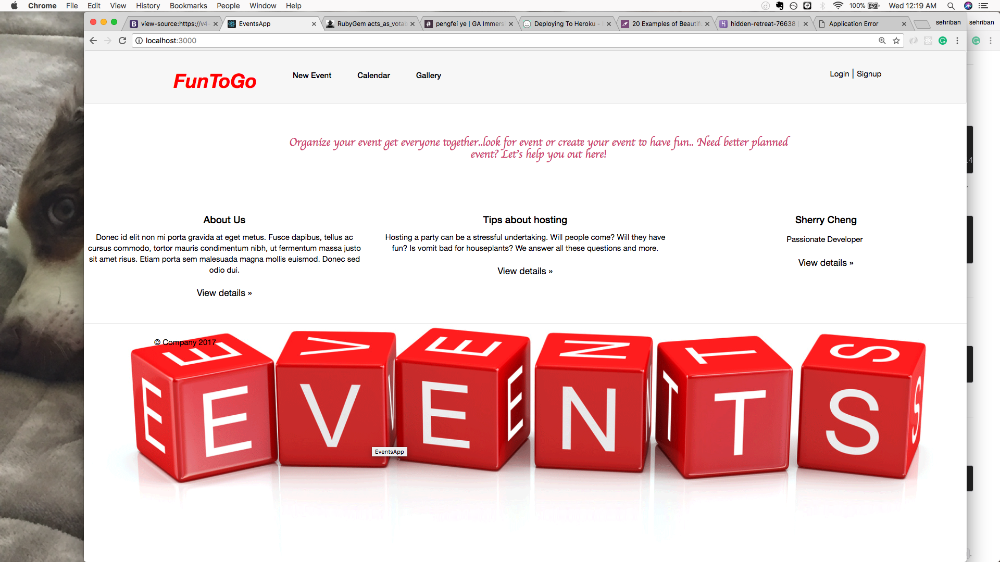

# README

Final Project: FunToGo
===================

**FunToGo** is a planning and organizing web based application for your events needs.

----------

----------

----------

----------

**Sherry Cheng** - https://github.com/sgc88

----------

Technologies
-------------------
  * HTML
  * RubyOnRails
  * CSS
  * Bootstrap
  * gem 'simple-calendar'
  * gem 'acts_as_votable
  * bycrpt
  * activerecord

----------

Existing Features
-------------------
* User Authentication/authorization
* Users can show, create, update, and delete "events".
* Users can only have full access to events that they have created.
* Users can use click on going button if they are going participate
* user can see all events based on their location
* Users can see the full calendar

----------

Planned Features
-------------------
* Be able to invite people via email/text
* Be able to receive friendly reminder email
* Be able to create a list of stuff when they want to contribute to the event
* Be able to see the location on map and get directions.

* ...
# FINAL
# FINAL
